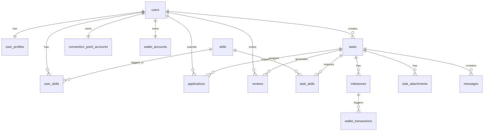

# 数据库 & API 设计

> 基于 [PRODUCT.md](PRODUCT.md) 整理，技术栈：PostgreSQL + Go API（Gin）+ Next.js
>
> API 前缀统一为 `/api`，认证使用 `Authorization: Bearer <JWT>`

---

## 目录

- [一、数据库设计](#一数据库设计)
  - [枚举值定义](#枚举值定义)
  - [表结构](#表结构)
  - [索引策略](#索引策略)
  - [ER 关系图](#er-关系图)
- [二、API 接口设计](#二api-接口设计)
  - [接口规范](#接口规范)
  - [认证模块](#认证模块-apiv1auth)
  - [用户模块](#用户模块-apiv1users)
  - [技能标签模块](#技能标签模块-apiv1skills)
  - [任务模块](#任务模块-apiv1tasks)
  - [里程碑模块](#里程碑模块-apiv1taskstask_idmilestones)
  - [申请模块](#申请模块-apiv1taskstask_idapplications)
  - [消息模块](#消息模块-apiv1messages)
  - [评价模块](#评价模块-apiv1reviews)
  - [邀约点模块](#邀约点模块-apiv1connection-points)
  - [钱包模块](#钱包模块-apiv1wallet)
  - [文件上传](#文件上传-apiv1uploads)

---

## 一、数据库设计

### 枚举值定义

```sql
-- 用户角色
CREATE TYPE user_role AS ENUM ('client', 'freelancer');

-- 实名认证状态
CREATE TYPE verification_status AS ENUM ('unverified', 'pending', 'verified', 'rejected');

-- 任务计费模式
CREATE TYPE pricing_type AS ENUM ('fixed', 'milestone', 'hourly');

-- 任务状态
CREATE TYPE task_status AS ENUM (
  'draft',           -- 草稿
  'pending_accept',  -- 待接单（已发布）
  'accepted',        -- 已接单
  'in_progress',     -- 进行中
  'pending_review',  -- 待最终验收
  'completed',       -- 已完成
  'closed'           -- 已关闭/已取消
);

-- 里程碑状态
CREATE TYPE milestone_status AS ENUM (
  'pending',         -- 待开始
  'in_progress',     -- 进行中
  'submitted',       -- 已提交交付物
  'approved',        -- 客户已验收
  'paid'             -- 已付款
);

-- 申请状态
CREATE TYPE application_status AS ENUM (
  'pending',         -- 待客户回应
  'accepted',        -- 客户已接受
  'rejected',        -- 客户已拒绝
  'withdrawn'        -- 服务者已撤回
);

-- 邀约点变动类型
CREATE TYPE cp_log_type AS ENUM (
  'verification_reward',  -- 实名认证奖励
  'daily_checkin',        -- 每日签到
  'invite_reward',        -- 邀请好友奖励
  'task_complete_reward', -- 任务完成奖励
  'purchase',             -- 付费购买
  'consumed'              -- 联系客户消耗
);

-- 钱包流水类型
CREATE TYPE wallet_tx_type AS ENUM (
  'freeze',           -- 冻结（客户发布任务/里程碑）
  'unfreeze',         -- 解冻（任务取消）
  'release',          -- 打款给服务者（里程碑通过）
  'withdraw',         -- 服务者提现
  'recharge'          -- 充值
);

-- 任务可见性
CREATE TYPE task_visibility AS ENUM ('public', 'invite_only');
```

---

### 表结构

#### `users` — 用户账号

```sql
CREATE TABLE users (
  id UUID PRIMARY KEY DEFAULT gen_random_uuid()
  phone             VARCHAR(20) UNIQUE,                    -- 手机号（与微信二选一）
  wechat_openid     VARCHAR(128) UNIQUE,                   -- 微信 OpenID
  role              user_role NOT NULL,                    -- 身份：client / freelancer
  verification      verification_status NOT NULL DEFAULT 'unverified',
  is_active         BOOLEAN NOT NULL DEFAULT TRUE,
  created_at        TIMESTAMPTZ NOT NULL DEFAULT NOW(),
  updated_at        TIMESTAMPTZ NOT NULL DEFAULT NOW()
);
```


| 字段              | 类型                  | 说明                        |
| --------------- | ------------------- | ------------------------- |
| `id`            | BIGSERIAL           | 主键                        |
| `phone`         | VARCHAR(20)         | 手机号，与 `wechat_openid` 二选一 |
| `wechat_openid` | VARCHAR(128)        | 微信 OpenID                 |
| `role`          | user_role           | 首次登录后必须选择                 |
| `verification`  | verification_status | 实名认证状态                    |
| `is_active`     | BOOLEAN             | 账号是否启用                    |


---

#### `user_profiles` — 用户扩展资料

```sql
CREATE TABLE user_profiles (
  user_id           BIGINT PRIMARY KEY REFERENCES users(id) ON DELETE CASCADE,
  display_name      VARCHAR(64) NOT NULL DEFAULT '',
  avatar_url        TEXT,
  bio               TEXT,                                  -- 个人简介
  portfolio_urls    TEXT[],                                -- 作品集链接数组
  avg_rating        NUMERIC(3,2) NOT NULL DEFAULT 0.00,   -- 平均评分（冗余，异步更新）
  review_count      INT NOT NULL DEFAULT 0,
  completed_tasks   INT NOT NULL DEFAULT 0,
  hourly_rate       NUMERIC(10,2),                        -- 服务者期望时薪（可选）
  location          VARCHAR(128),
  created_at        TIMESTAMPTZ NOT NULL DEFAULT NOW(),
  updated_at        TIMESTAMPTZ NOT NULL DEFAULT NOW()
);
```

---

#### `skills` — 技能标签字典

```sql
CREATE TABLE skills (
  id          SERIAL PRIMARY KEY,
  name        VARCHAR(64) NOT NULL UNIQUE,   -- 如：UI设计、React、文案策划
  category    VARCHAR(64),                   -- 一级分类，如：设计、开发、写作
  is_active   BOOLEAN NOT NULL DEFAULT TRUE,
  sort_order  INT NOT NULL DEFAULT 0
);
```

---

#### `user_skills` — 用户技能关联

```sql
CREATE TABLE user_skills (
  user_id   BIGINT NOT NULL REFERENCES users(id) ON DELETE CASCADE,
  skill_id  INT NOT NULL REFERENCES skills(id) ON DELETE CASCADE,
  PRIMARY KEY (user_id, skill_id)
);
```

---

#### `connection_point_accounts` — 邀约点账户

```sql
CREATE TABLE connection_point_accounts (
  user_id   BIGINT PRIMARY KEY REFERENCES users(id) ON DELETE CASCADE,
  balance   INT NOT NULL DEFAULT 0,          -- 当前余额（单位：点）
  updated_at TIMESTAMPTZ NOT NULL DEFAULT NOW()
);
```

---

#### `connection_point_logs` — 邀约点流水

```sql
CREATE TABLE connection_point_logs (
  id          BIGSERIAL PRIMARY KEY,
  user_id     BIGINT NOT NULL REFERENCES users(id) ON DELETE CASCADE,
  type        cp_log_type NOT NULL,
  amount      INT NOT NULL,                  -- 正数为获取，负数为消耗
  balance_after INT NOT NULL,               -- 操作后余额
  ref_id      BIGINT,                        -- 关联任务 ID 或申请 ID（可选）
  note        TEXT,
  created_at  TIMESTAMPTZ NOT NULL DEFAULT NOW()
);
```

---

#### `tasks` — 任务主表

```sql
CREATE TABLE tasks (
  id                BIGSERIAL PRIMARY KEY,
  client_id         BIGINT NOT NULL REFERENCES users(id),
  freelancer_id     BIGINT REFERENCES users(id),           -- 接单后填入

  title             VARCHAR(256) NOT NULL,
  description       TEXT NOT NULL,                        -- 富文本 HTML
  pricing_type      pricing_type NOT NULL,
  status            task_status NOT NULL DEFAULT 'pending_accept',
  visibility        task_visibility NOT NULL DEFAULT 'public',

  -- 固定总价 / 按小时（通用字段）
  budget_amount     NUMERIC(12,2),                        -- 总预算或最高预算封顶
  duration_days     INT,                                  -- 预计完成天数（fixed 模式）

  -- 按小时
  hourly_rate       NUMERIC(10,2),                        -- 时薪
  estimated_hours   INT,                                  -- 预计总小时数

  -- 里程碑模式总金额（由里程碑表汇总，冗余存储）
  milestone_total   NUMERIC(12,2),

  contact_cost      INT NOT NULL DEFAULT 5,               -- 联系所需邀约点
  deadline          DATE,                                 -- 任务截止日期
  published_at      TIMESTAMPTZ,
  completed_at      TIMESTAMPTZ,
  created_at        TIMESTAMPTZ NOT NULL DEFAULT NOW(),
  updated_at        TIMESTAMPTZ NOT NULL DEFAULT NOW()
);
```


| 字段              | 类型              | 说明                   |
| --------------- | --------------- | -------------------- |
| `client_id`     | BIGINT          | 发布者（客户）              |
| `freelancer_id` | BIGINT          | 接单者（任务接受后赋值）         |
| `pricing_type`  | pricing_type    | 计费模式                 |
| `contact_cost`  | INT             | 服务者联系需消耗的邀约点，0 表示公开  |
| `visibility`    | task_visibility | public / invite_only |


---

#### `task_skills` — 任务技能需求

```sql
CREATE TABLE task_skills (
  task_id   BIGINT NOT NULL REFERENCES tasks(id) ON DELETE CASCADE,
  skill_id  INT NOT NULL REFERENCES skills(id) ON DELETE CASCADE,
  PRIMARY KEY (task_id, skill_id)
);
```

---

#### `task_attachments` — 任务附件

```sql
CREATE TABLE task_attachments (
  id          BIGSERIAL PRIMARY KEY,
  task_id     BIGINT NOT NULL REFERENCES tasks(id) ON DELETE CASCADE,
  uploader_id BIGINT NOT NULL REFERENCES users(id),
  file_url    TEXT NOT NULL,
  file_name   VARCHAR(256) NOT NULL,
  file_size   BIGINT,                        -- 字节数
  mime_type   VARCHAR(128),
  created_at  TIMESTAMPTZ NOT NULL DEFAULT NOW()
);
```

---

#### `milestones` — 里程碑

```sql
CREATE TABLE milestones (
  id            BIGSERIAL PRIMARY KEY,
  task_id       BIGINT NOT NULL REFERENCES tasks(id) ON DELETE CASCADE,
  seq           SMALLINT NOT NULL,           -- 顺序编号（1,2,3...）
  title         VARCHAR(256) NOT NULL,
  description   TEXT,                        -- 交付物说明
  amount        NUMERIC(12,2) NOT NULL,
  due_date      DATE,
  status        milestone_status NOT NULL DEFAULT 'pending',
  submitted_at  TIMESTAMPTZ,
  approved_at   TIMESTAMPTZ,
  paid_at       TIMESTAMPTZ,
  created_at    TIMESTAMPTZ NOT NULL DEFAULT NOW(),
  updated_at    TIMESTAMPTZ NOT NULL DEFAULT NOW(),
  UNIQUE (task_id, seq)
);
```

---

#### `applications` — 服务者申请/联系记录

```sql
CREATE TABLE applications (
  id              BIGSERIAL PRIMARY KEY,
  task_id         BIGINT NOT NULL REFERENCES tasks(id) ON DELETE CASCADE,
  freelancer_id   BIGINT NOT NULL REFERENCES users(id),
  status          application_status NOT NULL DEFAULT 'pending',
  message         TEXT,                      -- 首次联系时的自我介绍
  cp_consumed     INT NOT NULL DEFAULT 0,    -- 消耗的邀约点数
  created_at      TIMESTAMPTZ NOT NULL DEFAULT NOW(),
  updated_at      TIMESTAMPTZ NOT NULL DEFAULT NOW(),
  UNIQUE (task_id, freelancer_id)            -- 同一任务每个服务者只能申请一次
);
```

---

#### `messages` — 站内消息

```sql
CREATE TABLE messages (
  id            BIGSERIAL PRIMARY KEY,
  task_id       BIGINT NOT NULL REFERENCES tasks(id) ON DELETE CASCADE,
  sender_id     BIGINT NOT NULL REFERENCES users(id),
  content       TEXT NOT NULL,
  is_read       BOOLEAN NOT NULL DEFAULT FALSE,
  created_at    TIMESTAMPTZ NOT NULL DEFAULT NOW()
);
```

---

#### `reviews` — 双向评价

```sql
CREATE TABLE reviews (
  id            BIGSERIAL PRIMARY KEY,
  task_id       BIGINT NOT NULL REFERENCES tasks(id),
  reviewer_id   BIGINT NOT NULL REFERENCES users(id),   -- 评价方
  reviewee_id   BIGINT NOT NULL REFERENCES users(id),   -- 被评价方
  rating        SMALLINT NOT NULL CHECK (rating BETWEEN 1 AND 5),
  content       TEXT,
  tags          TEXT[],                                  -- 快捷标签，如：["沟通顺畅","交付准时"]
  created_at    TIMESTAMPTZ NOT NULL DEFAULT NOW(),
  UNIQUE (task_id, reviewer_id)                          -- 每个任务每人只评价一次
);
```

---

#### `wallet_accounts` — 资金账户

```sql
CREATE TABLE wallet_accounts (
  user_id       BIGINT PRIMARY KEY REFERENCES users(id) ON DELETE CASCADE,
  frozen        NUMERIC(12,2) NOT NULL DEFAULT 0.00,    -- 冻结中（任务托管）
  available     NUMERIC(12,2) NOT NULL DEFAULT 0.00,    -- 可提现余额
  total_earned  NUMERIC(12,2) NOT NULL DEFAULT 0.00,    -- 累计收入（服务者）
  total_spent   NUMERIC(12,2) NOT NULL DEFAULT 0.00,    -- 累计支出（客户）
  updated_at    TIMESTAMPTZ NOT NULL DEFAULT NOW()
);
```

---

#### `wallet_transactions` — 资金流水

```sql
CREATE TABLE wallet_transactions (
  id              BIGSERIAL PRIMARY KEY,
  user_id         BIGINT NOT NULL REFERENCES users(id),
  type            wallet_tx_type NOT NULL,
  amount          NUMERIC(12,2) NOT NULL,               -- 正数收入，负数支出
  balance_after   NUMERIC(12,2) NOT NULL,               -- 操作后可用余额
  ref_task_id     BIGINT REFERENCES tasks(id),
  ref_milestone_id BIGINT REFERENCES milestones(id),
  note            TEXT,
  created_at      TIMESTAMPTZ NOT NULL DEFAULT NOW()
);
```

---

### 索引策略

```sql
-- 任务查询（Find 页高频）
CREATE INDEX idx_tasks_status_visibility ON tasks(status, visibility);
CREATE INDEX idx_tasks_client_id ON tasks(client_id);
CREATE INDEX idx_tasks_freelancer_id ON tasks(freelancer_id);
CREATE INDEX idx_tasks_created_at ON tasks(created_at DESC);

-- 技能筛选
CREATE INDEX idx_task_skills_skill_id ON task_skills(skill_id);
CREATE INDEX idx_user_skills_skill_id ON user_skills(skill_id);

-- 消息查询
CREATE INDEX idx_messages_task_id ON messages(task_id);
CREATE INDEX idx_messages_sender_id ON messages(sender_id);

-- 申请查询
CREATE INDEX idx_applications_task_id ON applications(task_id);
CREATE INDEX idx_applications_freelancer_id ON applications(freelancer_id);

-- 评价查询
CREATE INDEX idx_reviews_reviewee_id ON reviews(reviewee_id);

-- 流水查询
CREATE INDEX idx_cp_logs_user_id ON connection_point_logs(user_id);
CREATE INDEX idx_wallet_tx_user_id ON wallet_transactions(user_id);
```

---

### ER 关系图




---

## 二、API 接口设计

### 接口规范

#### 通用响应格式

```json
{
  "code": 0,
  "message": "ok",
  "data": { }
}
```


| `code` | 含义                 |
| ------ | ------------------ |
| `0`    | 成功                 |
| `400`  | 请求参数错误             |
| `401`  | 未认证 / Token 失效     |
| `403`  | 权限不足               |
| `404`  | 资源不存在              |
| `409`  | 业务冲突（如：邀约点不足、重复申请） |
| `500`  | 服务器内部错误            |


#### 分页参数（列表接口通用）


| 参数          | 类型  | 默认值 | 说明         |
| ----------- | --- | --- | ---------- |
| `page`      | int | 1   | 页码（从 1 开始） |
| `page_size` | int | 20  | 每页数量，最大 50 |


分页响应结构：

```json
{
  "code": 0,
  "data": {
    "list": [],
    "total": 100,
    "page": 1,
    "page_size": 20
  }
}
```

---

### 认证模块 `/api/v1/auth`

#### `POST /api/v1/auth/send-code` — 发送短信验证码

**请求**

```json
{
  "phone": "13800138000"
}
```

**响应**

```json
{
  "code": 0,
  "message": "验证码已发送",
  "data": {
    "expires_in": 300
  }
}
```

---

#### `POST /api/v1/auth/login` — 手机号验证码登录

**请求**

```json
{
  "phone": "13800138000",
  "code": "123456"
}
```

**响应**（首次登录 `is_new_user: true`，前端跳转身份选择页）

```json
{
  "code": 0,
  "data": {
    "token": "eyJhbGci...",
    "is_new_user": true,
    "user": {
      "id": 1,
      "phone": "138****8000",
      "role": null
    }
  }
}
```

---

#### `POST /api/v1/auth/wechat-login` — 微信登录

**请求**

```json
{
  "code": "wx_auth_code_from_miniprogram"
}
```

**响应**（同上）

---

#### `POST /api/v1/auth/select-role` — 首次登录选择身份 🔒

**请求**

```json
{
  "role": "freelancer"
}
```

**响应**

```json
{
  "code": 0,
  "data": {
    "user": {
      "id": 1,
      "role": "freelancer"
    }
  }
}
```

---

### 用户模块 `/api/v1/users`

#### `GET /api/v1/users/me` — 获取当前用户信息 🔒

**响应**

```json
{
  "code": 0,
  "data": {
    "id": 1,
    "phone": "138****8000",
    "role": "freelancer",
    "verification": "verified",
    "profile": {
      "display_name": "张三",
      "avatar_url": "https://cdn.example.com/avatar.jpg",
      "bio": "5年 React 开发经验",
      "portfolio_urls": ["https://github.com/zhangsan"],
      "avg_rating": 4.85,
      "review_count": 23,
      "completed_tasks": 18,
      "hourly_rate": 200.00,
      "location": "上海"
    },
    "skills": [
      { "id": 1, "name": "React", "category": "开发" }
    ]
  }
}
```

---

#### `PUT /api/v1/users/me` — 更新当前用户资料 🔒

**请求**

```json
{
  "display_name": "张三",
  "bio": "5年 React 开发经验",
  "portfolio_urls": ["https://github.com/zhangsan"],
  "hourly_rate": 200.00,
  "location": "上海",
  "skill_ids": [1, 3, 5]
}
```

---

#### `GET /api/v1/users/:id` — 获取用户公开主页

**响应**（同 `/me`，隐藏手机号，含近期评价列表）

---

#### `POST /api/v1/users/me/verification` — 提交实名认证 🔒

**请求**

```json
{
  "real_name": "张三",
  "id_card": "310101199001011234"
}
```

---

### 技能标签模块 `/api/v1/skills`

#### `GET /api/v1/skills` — 获取技能标签列表

**Query 参数**


| 参数         | 类型     | 说明           |
| ---------- | ------ | ------------ |
| `category` | string | 按分类筛选，如 `开发` |
| `q`        | string | 模糊搜索         |


**响应**

```json
{
  "code": 0,
  "data": {
    "categories": [
      {
        "name": "开发",
        "skills": [
          { "id": 1, "name": "React" },
          { "id": 2, "name": "Go" }
        ]
      }
    ]
  }
}
```

---

### 任务模块 `/api/v1/tasks`

#### `GET /api/v1/tasks` — 任务列表（Find 页，无限滚动）

**Query 参数**


| 参数             | 类型     | 说明                         |
| -------------- | ------ | -------------------------- |
| `skill_ids`    | int[]  | 技能筛选，逗号分隔                  |
| `budget_min`   | number | 最低预算（元）                    |
| `budget_max`   | number | 最高预算（元）                    |
| `pricing_type` | string | fixed / milestone / hourly |
| `duration_max` | int    | 最长周期（天）                    |
| `location`     | string | 地区（可选）                     |
| `cursor`       | string | 游标分页（上一页最后一条 `id`）         |
| `page_size`    | int    | 默认 20                      |


**响应**

```json
{
  "code": 0,
  "data": {
    "list": [
      {
        "id": 42,
        "title": "开发一个 React 后台管理系统",
        "pricing_type": "fixed",
        "budget_amount": 8000.00,
        "duration_days": 30,
        "contact_cost": 5,
        "status": "pending_accept",
        "skills": [{ "id": 1, "name": "React" }],
        "created_at": "2026-06-01T10:00:00Z"
      }
    ],
    "next_cursor": "38",
    "has_more": true
  }
}
```

---

#### `POST /api/v1/tasks` — 发布任务 🔒（仅客户）

**请求**

```json
{
  "title": "开发一个 React 后台管理系统",
  "description": "<p>需要一个...</p>",
  "skill_ids": [1, 2],
  "pricing_type": "milestone",
  "contact_cost": 5,
  "deadline": "2026-07-31",
  "visibility": "public",
  "milestones": [
    {
      "seq": 1,
      "title": "原型设计",
      "description": "提供可点击原型",
      "amount": 2000.00,
      "due_date": "2026-06-20"
    },
    {
      "seq": 2,
      "title": "开发完成",
      "description": "完整代码及部署",
      "amount": 6000.00,
      "due_date": "2026-07-20"
    }
  ]
}
```

> 固定总价时：包含 `budget_amount`、`duration_days`；
> 按小时时：包含 `hourly_rate`、`estimated_hours`、`budget_amount`（封顶）。

**响应**

```json
{
  "code": 0,
  "data": {
    "id": 42,
    "status": "pending_accept"
  }
}
```

---

#### `GET /api/v1/tasks/:id` — 任务详情

**响应**（包含完整任务信息、里程碑列表、技能标签、客户基础资料）

```json
{
  "code": 0,
  "data": {
    "id": 42,
    "title": "开发一个 React 后台管理系统",
    "description": "<p>需要一个...</p>",
    "pricing_type": "milestone",
    "status": "in_progress",
    "contact_cost": 5,
    "deadline": "2026-07-31",
    "visibility": "public",
    "client": {
      "id": 10,
      "display_name": "李四科技",
      "avatar_url": "https://cdn.example.com/avatar2.jpg",
      "avg_rating": 4.9
    },
    "freelancer": null,
    "skills": [{ "id": 1, "name": "React" }],
    "milestones": [
      {
        "id": 1,
        "seq": 1,
        "title": "原型设计",
        "amount": 2000.00,
        "due_date": "2026-06-20",
        "status": "paid"
      }
    ],
    "attachments": [],
    "created_at": "2026-06-01T10:00:00Z"
  }
}
```

---

#### `PUT /api/v1/tasks/:id` — 更新任务 🔒（仅客户，草稿/待接单状态）

**请求**（字段同发布，仅传需修改的字段）

---

#### `PATCH /api/v1/tasks/:id/status` — 变更任务状态 🔒

**请求**

```json
{
  "action": "start",
  "note": "开始工作"
}
```


| `action`             | 操作方 | 状态变化                         | 说明                          |
| -------------------- | --- | ---------------------------- | --------------------------- |
| `publish`            | 客户  | draft → pending_accept       | 发布草稿                        |
| `accept_application` | 客户  | pending_accept → accepted    | 接受服务者申请，需传 `application_id` |
| `start`              | 服务者 | accepted → in_progress       | 确认开始工作                      |
| `submit_review`      | 服务者 | in_progress → pending_review | 提交最终验收                      |
| `complete`           | 客户  | pending_review → completed   | 客户验收通过，完成任务                 |
| `close`              | 客户  | 任意 → closed                  | 关闭/取消任务                     |


---

### 里程碑模块 `/api/v1/tasks/:task_id/milestones`

#### `GET /api/v1/tasks/:task_id/milestones` — 获取里程碑列表 🔒

**响应**

```json
{
  "code": 0,
  "data": [
    {
      "id": 1,
      "seq": 1,
      "title": "原型设计",
      "description": "提供可点击原型",
      "amount": 2000.00,
      "due_date": "2026-06-20",
      "status": "submitted",
      "submitted_at": "2026-06-18T09:00:00Z"
    }
  ]
}
```

---

#### `PATCH /api/v1/tasks/:task_id/milestones/:id/status` — 变更里程碑状态 🔒

**请求**

```json
{
  "action": "submit",
  "note": "已按要求完成原型"
}
```


| `action`  | 操作方 | 状态变化                            |
| --------- | --- | ------------------------------- |
| `submit`  | 服务者 | pending/in_progress → submitted |
| `approve` | 客户  | submitted → approved            |
| `reject`  | 客户  | submitted → in_progress（要求修改）   |
| `pay`     | 客户  | approved → paid（触发资金解冻+转账）      |


---

#### `POST /api/v1/tasks/:task_id/milestones/:id/attachments` — 上传里程碑交付物 🔒（服务者）

**请求**：`multipart/form-data`，字段 `file`

---

### 申请模块 `/api/v1/tasks/:task_id/applications`

#### `POST /api/v1/tasks/:task_id/applications` — 服务者申请/联系客户 🔒（仅服务者）

> 触发邀约点扣减，不足则返回 `409`

**请求**

```json
{
  "message": "您好，我有5年React开发经验，可以在截止日期前完成..."
}
```

**响应**

```json
{
  "code": 0,
  "data": {
    "id": 88,
    "status": "pending",
    "cp_consumed": 5,
    "cp_balance_after": 45
  }
}
```

---

#### `GET /api/v1/tasks/:task_id/applications` — 查看申请列表 🔒（仅该任务客户）

**响应**

```json
{
  "code": 0,
  "data": {
    "list": [
      {
        "id": 88,
        "freelancer": {
          "id": 5,
          "display_name": "王五",
          "avg_rating": 4.7,
          "completed_tasks": 12,
          "skills": [{ "id": 1, "name": "React" }]
        },
        "message": "您好，我有5年React开发经验...",
        "status": "pending",
        "created_at": "2026-06-02T08:00:00Z"
      }
    ],
    "total": 3
  }
}
```

---

#### `PATCH /api/v1/tasks/:task_id/applications/:id` — 接受或拒绝申请 🔒（仅客户）

**请求**

```json
{
  "action": "accept"
}
```


| `action` | 说明                              |
| -------- | ------------------------------- |
| `accept` | 接受申请，任务状态变为 `accepted`，其他申请自动拒绝 |
| `reject` | 拒绝该申请                           |


---

### 消息模块 `/api/v1/messages`

#### `GET /api/v1/messages/tasks/:task_id` — 获取任务对话消息 🔒

**Query 参数**：`before_id`（游标，加载更早消息）、`page_size`（默认 30）

**响应**

```json
{
  "code": 0,
  "data": {
    "list": [
      {
        "id": 200,
        "sender": {
          "id": 5,
          "display_name": "王五",
          "avatar_url": "https://cdn.example.com/avatar3.jpg"
        },
        "content": "原型已完成，请查看附件",
        "is_read": false,
        "created_at": "2026-06-18T10:00:00Z"
      }
    ],
    "has_more": false
  }
}
```

---

#### `POST /api/v1/messages/tasks/:task_id` — 发送消息 🔒

**请求**

```json
{
  "content": "收到，稍后查看"
}
```

---

#### `PATCH /api/v1/messages/tasks/:task_id/read` — 标记消息已读 🔒

---

### 评价模块 `/api/v1/reviews`

#### `POST /api/v1/reviews` — 提交评价 🔒

> 任务状态为 `completed` 后开放，每人只能评价一次

**请求**

```json
{
  "task_id": 42,
  "rating": 5,
  "content": "沟通顺畅，交付准时，非常专业",
  "tags": ["沟通顺畅", "交付准时", "代码质量高"]
}
```

---

#### `GET /api/v1/users/:user_id/reviews` — 查看用户收到的评价列表

**Query 参数**：`page`、`page_size`

**响应**

```json
{
  "code": 0,
  "data": {
    "avg_rating": 4.85,
    "total": 23,
    "list": [
      {
        "id": 10,
        "task_id": 42,
        "reviewer": {
          "id": 10,
          "display_name": "李四科技",
          "avatar_url": "https://cdn.example.com/avatar2.jpg"
        },
        "rating": 5,
        "content": "沟通顺畅，交付准时",
        "tags": ["沟通顺畅", "交付准时"],
        "created_at": "2026-06-25T12:00:00Z"
      }
    ],
    "page": 1,
    "page_size": 20
  }
}
```

---

### 邀约点模块 `/api/v1/connection-points`

#### `GET /api/v1/connection-points/me` — 查询当前余额 🔒

**响应**

```json
{
  "code": 0,
  "data": {
    "balance": 45
  }
}
```

---

#### `GET /api/v1/connection-points/logs` — 邀约点流水记录 🔒

**响应**

```json
{
  "code": 0,
  "data": {
    "list": [
      {
        "id": 5,
        "type": "consumed",
        "amount": -5,
        "balance_after": 45,
        "note": "联系任务：开发一个 React 后台管理系统",
        "created_at": "2026-06-02T08:00:00Z"
      }
    ],
    "total": 10,
    "page": 1
  }
}
```

---

#### `POST /api/v1/connection-points/checkin` — 每日签到领取邀约点 🔒

**响应**

```json
{
  "code": 0,
  "data": {
    "awarded": 2,
    "balance": 47,
    "already_checked_in": false
  }
}
```

---

#### `POST /api/v1/connection-points/purchase` — 购买邀约点 🔒

**请求**

```json
{
  "package_id": "cp_100",
  "payment_method": "wechat"
}
```

---

### 钱包模块 `/api/v1/wallet`

#### `GET /api/v1/wallet/me` — 查询钱包余额 🔒

**响应**

```json
{
  "code": 0,
  "data": {
    "available": 3500.00,
    "frozen": 2000.00,
    "total_earned": 28000.00,
    "total_spent": 0.00
  }
}
```

---

#### `GET /api/v1/wallet/transactions` — 钱包流水记录 🔒

**Query 参数**：`type`（可选，筛选流水类型）、`page`、`page_size`

**响应**

```json
{
  "code": 0,
  "data": {
    "list": [
      {
        "id": 100,
        "type": "release",
        "amount": 2000.00,
        "balance_after": 3500.00,
        "ref_task_id": 42,
        "ref_milestone_id": 1,
        "note": "里程碑「原型设计」付款",
        "created_at": "2026-06-20T14:00:00Z"
      }
    ],
    "total": 15,
    "page": 1
  }
}
```

---

#### `POST /api/v1/wallet/withdraw` — 申请提现 🔒（仅服务者）

**请求**

```json
{
  "amount": 1000.00,
  "method": "wechat",
  "account": "wx_account_id"
}
```

---

### 文件上传 `/api/v1/uploads`

#### `POST /api/v1/uploads` — 上传文件 🔒

**请求**：`multipart/form-data`


| 字段       | 类型     | 说明                                                     |
| -------- | ------ | ------------------------------------------------------ |
| `file`   | File   | 文件本体                                                   |
| `type`   | string | 用途：`avatar` / `task_attachment` / `milestone_delivery` |
| `ref_id` | int    | 关联 ID（task_id 或 milestone_id，type 非 avatar 时必填）        |


**响应**

```json
{
  "code": 0,
  "data": {
    "id": 55,
    "file_url": "https://cdn.example.com/uploads/file.pdf",
    "file_name": "原型设计稿.pdf",
    "file_size": 2048000,
    "mime_type": "application/pdf"
  }
}
```

---

## 接口权限汇总

> 🔒 = 需要 JWT 认证；角色限制额外说明


| 方法    | 路径                                             | 认证  | 角色限制            |
| ----- | ---------------------------------------------- | --- | --------------- |
| POST  | `/api/v1/auth/send-code`                       | 否   | —               |
| POST  | `/api/v1/auth/login`                           | 否   | —               |
| POST  | `/api/v1/auth/wechat-login`                    | 否   | —               |
| POST  | `/api/v1/auth/select-role`                     | 🔒  | —               |
| GET   | `/api/v1/users/me`                             | 🔒  | —               |
| PUT   | `/api/v1/users/me`                             | 🔒  | —               |
| GET   | `/api/v1/users/:id`                            | 否   | —               |
| POST  | `/api/v1/users/me/verification`                | 🔒  | —               |
| GET   | `/api/v1/skills`                               | 否   | —               |
| GET   | `/api/v1/tasks`                                | 否   | —               |
| POST  | `/api/v1/tasks`                                | 🔒  | client          |
| GET   | `/api/v1/tasks/:id`                            | 否   | —               |
| PUT   | `/api/v1/tasks/:id`                            | 🔒  | client（仅本人）     |
| PATCH | `/api/v1/tasks/:id/status`                     | 🔒  | 双方（按 action 区分） |
| GET   | `/api/v1/tasks/:task_id/milestones`            | 🔒  | 双方（任务参与者）       |
| PATCH | `/api/v1/tasks/:task_id/milestones/:id/status` | 🔒  | 双方（按 action 区分） |
| POST  | `/api/v1/tasks/:task_id/applications`          | 🔒  | freelancer      |
| GET   | `/api/v1/tasks/:task_id/applications`          | 🔒  | client（仅本人）     |
| PATCH | `/api/v1/tasks/:task_id/applications/:id`      | 🔒  | client（仅本人）     |
| GET   | `/api/v1/messages/tasks/:task_id`              | 🔒  | 双方（任务参与者）       |
| POST  | `/api/v1/messages/tasks/:task_id`              | 🔒  | 双方（任务参与者）       |
| POST  | `/api/v1/reviews`                              | 🔒  | 双方（任务参与者）       |
| GET   | `/api/v1/users/:user_id/reviews`               | 否   | —               |
| GET   | `/api/v1/connection-points/me`                 | 🔒  | —               |
| GET   | `/api/v1/connection-points/logs`               | 🔒  | —               |
| POST  | `/api/v1/connection-points/checkin`            | 🔒  | —               |
| POST  | `/api/v1/connection-points/purchase`           | 🔒  | —               |
| GET   | `/api/v1/wallet/me`                            | 🔒  | —               |
| GET   | `/api/v1/wallet/transactions`                  | 🔒  | —               |
| POST  | `/api/v1/wallet/withdraw`                      | 🔒  | freelancer      |
| POST  | `/api/v1/uploads`                              | 🔒  | —               |


