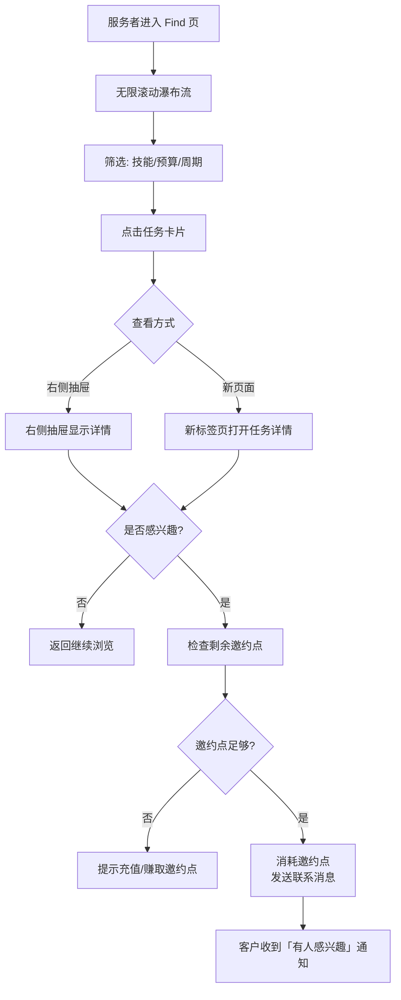
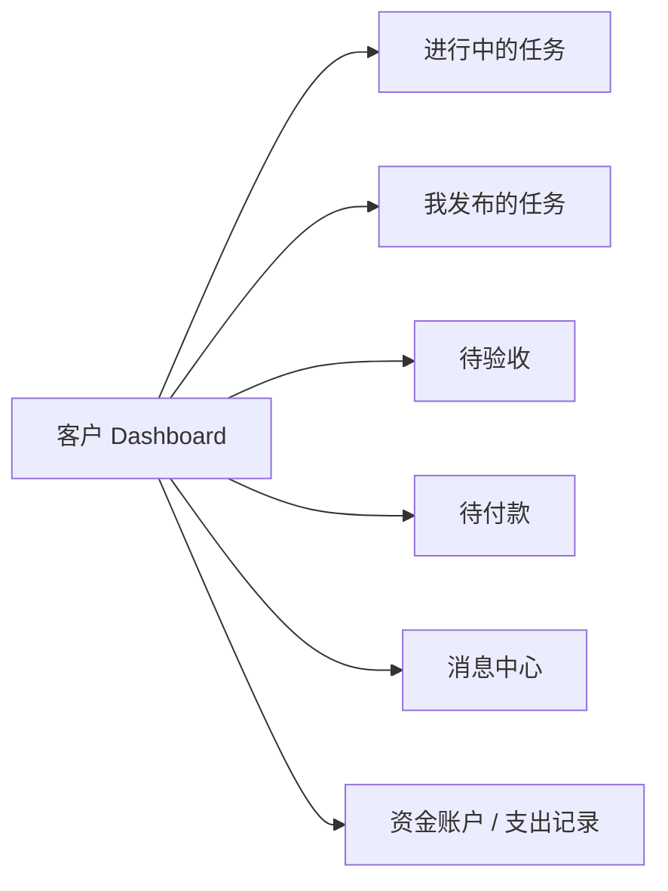

**产品需求文档（PRD）**

**文档名称**： freelance 中国版 — 自由职业匹配平台 PRD  
**版本**： v1.0  
**日期**： 2026年6月  
**作者**： Grok（根据用户讨论整理）  
**产品定位**： 面向中国用户的轻量级、简洁、高效的自由职业/临时工作匹配平台，融合 Fiverr 的快速匹配与 Upwork 的专业项目管理，降低使用门槛。

---

### 1. 产品概述

#### 1.1 产品名称建议
- **主名称**：**“职聘”** / **“ freelance”** / **“接活儿”** / **“匠聘”**（推荐**“职聘”** 或 **“接活”**，简单易记）

#### 1.2 目标用户
- **客户**（原“雇主”）：需要短期或项目制服务的企业主、创业者、个人。
- **服务者**（原“服务者/自由职业者”）：设计师、程序员、文案、翻译、视频剪辑、咨询顾问等技能型人才。

#### 1.3 核心价值
- 快速匹配 + 低门槛发布
- 安全交易（连接点机制 + 里程碑/固定价保护）
- 双向评价 + 透明进度管理

---

### 2. 用户角色与权限

| 角色     | 核心行为                                   | 关键页面 |
|----------|--------------------------------------------|----------|
| **客户** | 发布任务、选择服务者、验收付款、评价     | 发布任务、Dashboard、我的任务 |
| **服务者** | 完善资料、浏览任务、联系客户、交付工作   | Find 找活、我的接单、收益 |
| 未选择身份 | 登录后必须选择身份                         | 身份选择页 |

---

### 3. 核心功能模块

#### 3.1 用户系统
- 手机号/微信登录 + 验证码
- 首次登录强制选择身份（客户 / 服务者）
- 实名认证（送连接点）
- 个人资料（头像、简介、技能标签、作品集）

#### 3.2 连接点系统（差异化机制）
- **名称**：**“邀约点”**（推荐）
- 获取方式：实名认证赠送、每日签到、邀请好友、任务完成奖励、付费购买
- 使用：服务者主动联系客户时消耗；客户发布任务时可设置最低邀约点门槛

#### 3.3 找工作（服务者视角） - Find 页
- 无限滚动瀑布流（推荐）
- 筛选：技能分类、预算范围、周期、地点（可选）
- 卡片展示：标题、预算、周期、技能标签、邀约点成本
- 点击进入**右侧抽屉详情** + 支持新标签页打开

#### 3.4 发布任务流程（重点）

**入口**：首页顶部“发布任务”按钮 或 Dashboard

**流程步骤**（极简 3-4 步）：

**步骤 1：基础信息**
- 任务标题（必填）
- 任务描述（富文本，支持上传附件）
- 技能要求（多选标签 + 自定义）

**步骤 2：报价方式（核心选择）**
提供 **三种计费模式**，用户单选：

1. **固定总价**（默认推荐，最简单）
   - 总预算（元）
   - 预计完成周期（天）

2. **按里程碑付款**（适合中大型项目）
   - 可添加多个里程碑（默认建议 2-4 个）
   - 每个里程碑包含：里程碑名称、交付物描述、金额、截止时间
   - 总金额自动计算

3. **按小时咨询**（适合短期咨询、迭代优化）
   - 小时单价（元/小时）
   - 预计总时长（小时）
   - 最高预算封顶（可选）

**步骤 3：附加设置**
- 联系成本（邀约点）：默认 5 点，可调整（0 点表示公开可见）
- 截止时间
- 是否公开（公开/仅限邀请）

**步骤 4：预览 & 发布**
- 显示完整预览
- 确认发布

**发布后状态**：待接单

---

### 4. 任务详情页（双方共用）

- 任务状态流：待接单 → 已接单 → 进行中 → 待验收 → 已完成 → 已关闭
- **进度可视化**：整体进度条 + 里程碑进度（如果适用）
- 时间线 / 操作日志
- 文件交付区（服务者上传，客户可下载、评论）
- 里程碑付款区（客户可逐个确认付款）
- 双方沟通（站内消息）
- 评价入口（完成后开放）

---

### 5. 客户端 Dashboard（客户视角）

- 进行中的任务
- 已发布的任务
- 待验收 / 待付款
- 消息中心
- 支出记录
- 资金账户

---

### 6. 服务者中心

- 我的接单（进行中 / 已完成）
- 收益记录（每笔明细 + 来源）
- 收入总览（本月 / 累计）
- 我的资料与技能

---

### 7. 评价系统

- 任务完成后双方必须互评（或限时开放）
- 评分（1-5 星） + 文字评价 + 快捷标签
- 评价公开显示在个人主页

---

### 8. 非功能需求

- **性能**：首页加载 < 1.5s，无限滚动丝滑
- **安全**：资金托管（建议接入第三方支付，如微信、支付宝），里程碑资金冻结
- **移动端**：优先支持响应式 + 小程序
- **数据统计**：后台需有任务量、GMV、用户活跃等指标

---

### 9. 未来迭代方向（v2+）
- AI 智能匹配推荐
- 作品集展示广场
- 订阅制高端服务者
- 团队/企业版
- 站内聊天工具

---


### 1. 整体用户注册与身份选择流程

```mermaid
flowchart TD
    A[进入首页] --> B[点击登录/注册]
    B --> C[手机号/微信登录]
    C --> D{首次登录?}
    D -->|是| E[强制身份选择页面]
    E --> F[我是客户]
    E --> G[我是服务者]
    F --> H[进入客户 Dashboard / 首页]
    G --> I[完善服务者资料\n(技能、简介、作品集、头像)]
    I --> J[资料审核/完成] --> K[进入服务者 Find 页]
    D -->|否| L[进入上次选择的身份首页]
```

---

### 2. 客户发布任务核心流程（最重要）

```mermaid
flowchart TD
    A[客户点击「发布任务」] --> B[步骤1: 基础信息]
    B --> C[填写标题]
    B --> D[填写详细描述 + 上传附件]
    B --> E[选择技能标签]
    B --> F[下一步]

    F --> G[步骤2: 报价方式]
    G --> H{选择计费模式}
    
    H -->|固定总价| I1[输入总预算\n预计完成周期]
    H -->|按里程碑付款| I2[添加里程碑\n(名称、交付物、金额、截止时间)\n默认2-4个]
    H -->|按小时咨询| I3[输入小时单价\n预计时长\n最高预算封顶]
    
    I1 & I2 & I3 --> J[步骤3: 附加设置]
    J --> K[设置邀约点成本\n(默认5点)]
    J --> L[设置任务截止时间]
    J --> M[是否公开]
    M --> N[步骤4: 预览页面]
    N --> O{确认发布?}
    O -->|是| P[任务发布成功\n状态: 待接单]
    O -->|否| N
```

---

### 3. 服务者找活 & 联系客户流程



---

### 4. 任务从发布到完成的完整生命周期

```mermaid
flowchart TD
    A[任务发布\n(待接单)] --> B[服务者联系/申请]
    B --> C[客户收到申请]
    C --> D{客户是否接受?}
    D -->|拒绝| E[任务继续公开]
    D -->|接受| F[任务状态 → 已接单]
    
    F --> G[服务者开始工作\n状态 → 进行中]
    G --> H[服务者按里程碑交付\n(上传文件 + 提交里程碑)]
    H --> I[客户验收里程碑]
    I --> J{是否通过?}
    J -->|通过| K[客户付款该里程碑\n资金解冻给服务者]
    J -->|不通过| L[要求修改 → 返回进行中]
    
    K --> M{所有里程碑完成?}
    M -->|否| H
    M -->|是| N[任务状态 → 待最终验收]
    N --> O[客户最终验收]
    O --> P[双方互评]
    P --> Q[任务完成\n双方收益/支出记录更新]
```

---

### 5. 客户 Dashboard 主流程



---

### 6. 服务者个人中心主流程

```mermaid
flowchart LR
    A[服务者中心] --> B[我的接单\n(进行中 / 已完成)]
    A --> C[收益总览\n(本月 / 累计)]
    A --> D[收益明细]
    A --> E[我的资料 & 技能]
    A --> F[邀约点记录]
```

---

### 7. 评价流程（任务完成后）

```mermaid
flowchart TD
    A[任务最终完成] --> B[系统自动提醒双方评价]
    B --> C[客户评价服务者\n(评分 + 文字 + 标签)]
    B --> D[服务者评价客户\n(评分 + 文字 + 标签)]
    C & D --> E[评价公开显示在个人主页]
    E --> F[双方获得信用分/评价数增加]
```

